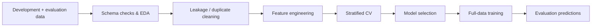

<div align="center">

# News Classification Pipeline

**Leakage-aware, reproducible text-classification pipeline with structured EDA, engineered metadata features, and cross-validated model selection.**


</div>

## Overview

This repository implements an end-to-end multiclass news-classification workflow built around a simple idea: **strong evaluation discipline matters as much as the classifier itself**.

The pipeline validates the input schema, audits the data for duplicates and leakage, compares development and evaluation distributions, engineers text + metadata features, evaluates models with stratified cross-validation, and retrains the selected configuration on the full cleaned development set.

## Pipeline



## What is implemented

### Data quality and leakage controls

- strict schema validation;
- duplicate and near-duplicate diagnostics;
- development/evaluation overlap checks;
- cross-label duplicate removal;
- source and feature drift analysis;
- missingness and placeholder diagnostics.

### Feature engineering

The model combines several signal families in a single sparse design matrix:

- word TF-IDF n-grams;
- character TF-IDF n-grams;
- optional title-only character features;
- text-length and pattern metadata;
- one-hot encoded news sources;
- numeric `page_rank`;
- timestamp-derived calendar and cyclical features;
- explicit missingness indicators.

### Modeling

Supported linear models include:

- `LinearSVC`;
- logistic regression;
- ridge classifier.

The default configuration uses a **Linear SVM**, a strong fit for high-dimensional sparse text features.

## Evaluation

The recommended entry point runs stratified k-fold cross-validation and records:

- macro, micro, and weighted F1;
- per-class metrics;
- confusion matrices;
- out-of-fold prediction counts;
- fold-level diagnostics and plots.

This makes the project easier to audit than a single train/test script and reduces the risk of reporting an overly optimistic one-off result.

## Repository layout

```text
.
├── configs/              # Model and feature configuration
├── data/                 # Raw / prepared datasets
├── docs/                 # Verified pipeline documentation
├── models/               # Serialized model + prediction artifacts
├── src/newsclf/          # Core package
│   ├── eda.py
│   ├── features.py
│   ├── io.py
│   ├── main.py
│   └── model.py
├── howto.txt             # Legacy entry-point notes
└── README.md
```

## Run the full pipeline

The unified entry point is the recommended workflow:

```bash
python -m newsclf.main
```

Configuration can be overridden from the command line, and outputs can be isolated in a custom run directory.

Examples:

```bash
python -m newsclf.main --run_dir runs/experiment_01
python -m newsclf.main --set model.C=2.0
```

Legacy modular scripts are still present, but the unified entry point is the most complete path because it includes the leakage-cleaning stage.

## Default inputs

```text
data/raw/development.csv
data/raw/evaluation.csv
```

Expected fields include news text, source, page-rank, timestamp, and the development-set label.

## Outputs

Cross-validation artifacts are written under `reports/cv/`, while final-model artifacts include:

- serialized trained model;
- submission predictions;
- prediction-distribution summaries;
- evaluation plots.

## Deeper documentation

For the repo-accurate implementation description, see:

[`docs/pipeline_overview.md`](./docs/pipeline_overview.md)

It documents the schema, cleaning logic, feature construction, model options, outputs, and entry points in detail.

## Why this project is useful

This project demonstrates more than text classification. It shows how to build a **defensible ML workflow** around messy real-world inputs: validate first, search for leakage, quantify distribution shift, make feature engineering reproducible, and only then compare models.

---

<sub>Machine-learning project focused on reproducibility, data quality, and model evaluation.</sub>
